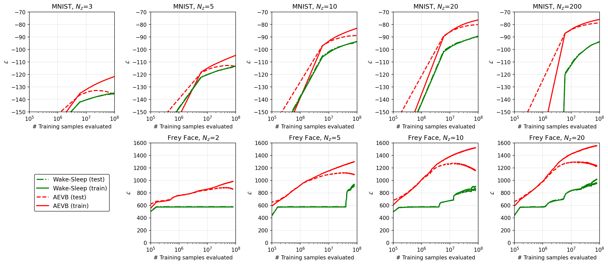
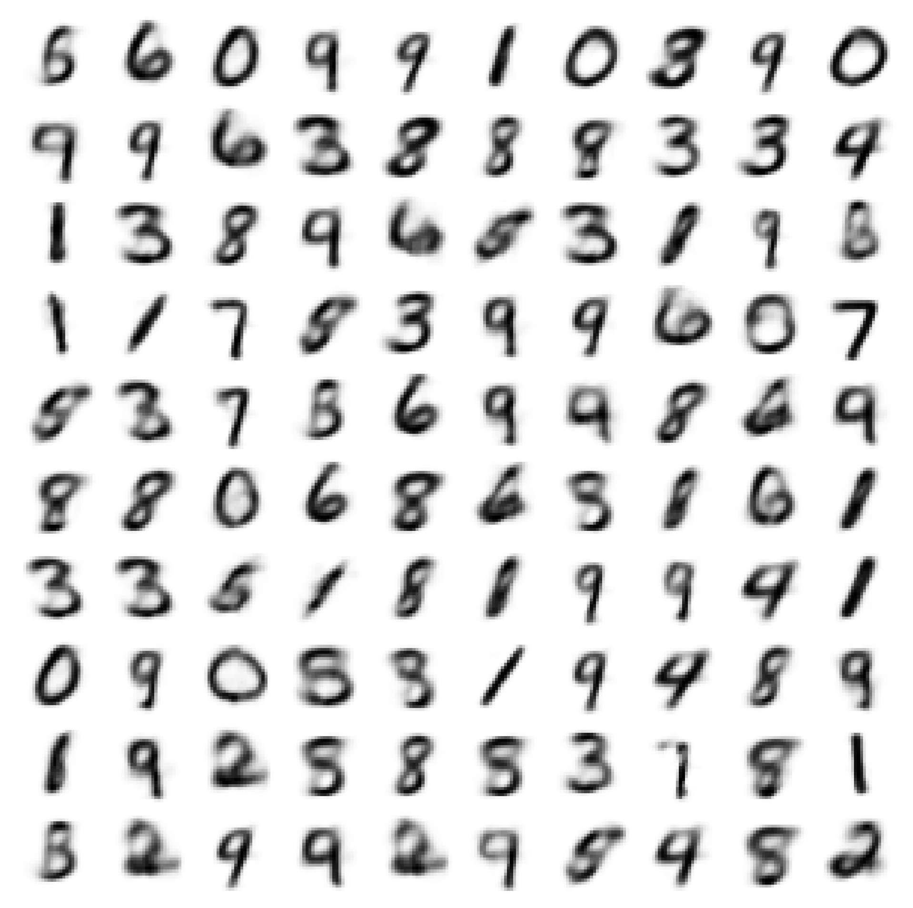
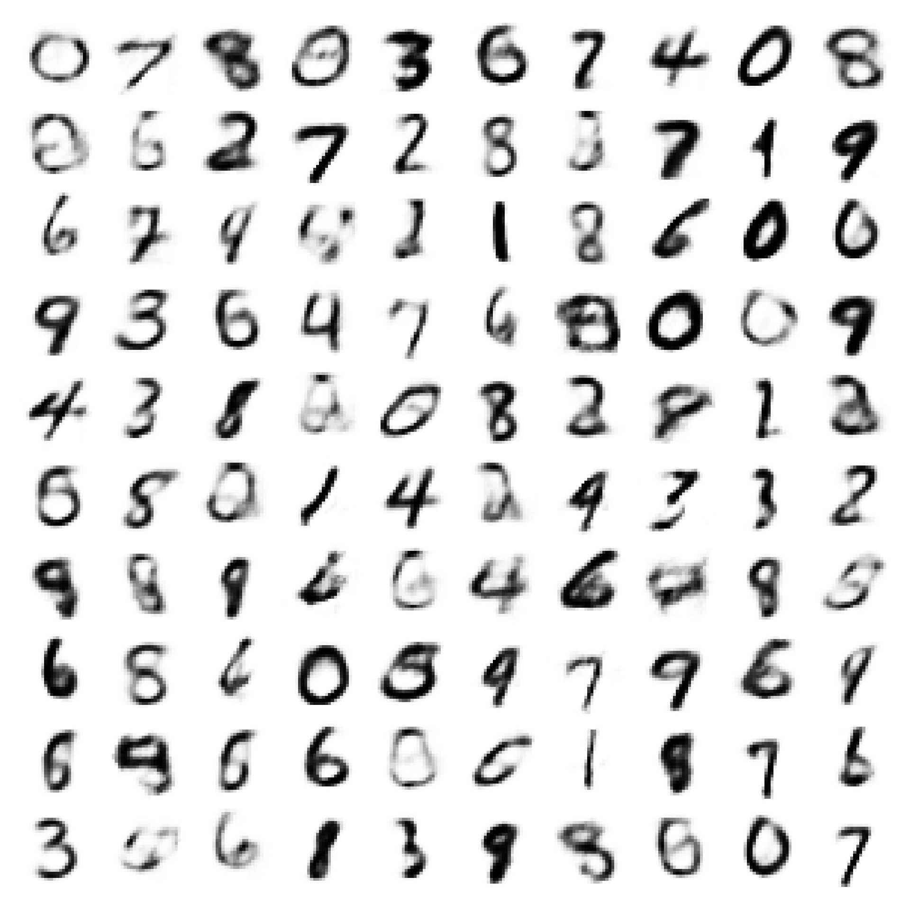
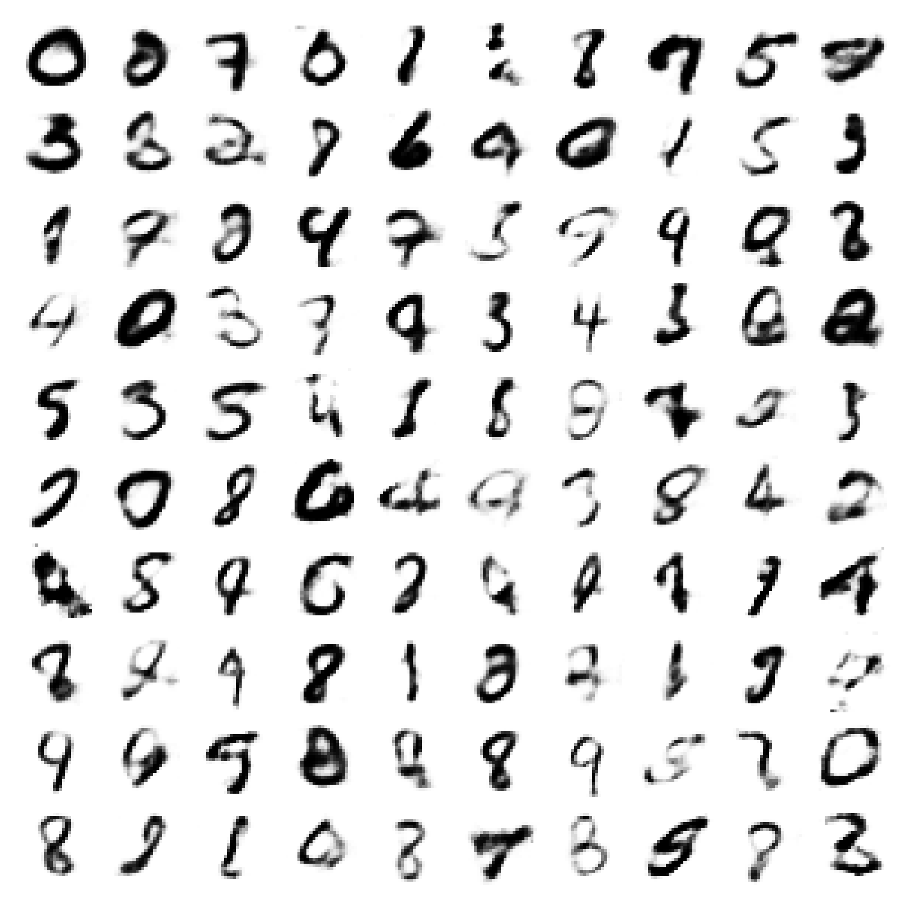
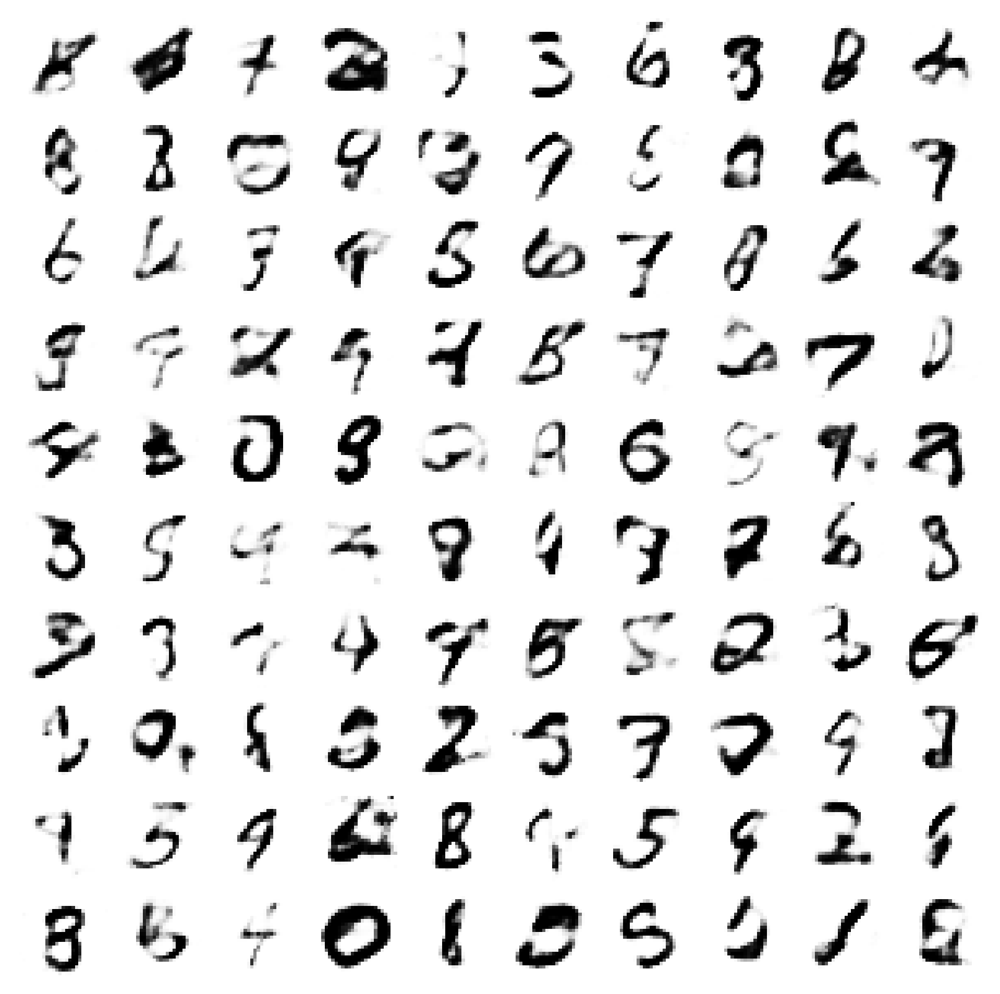
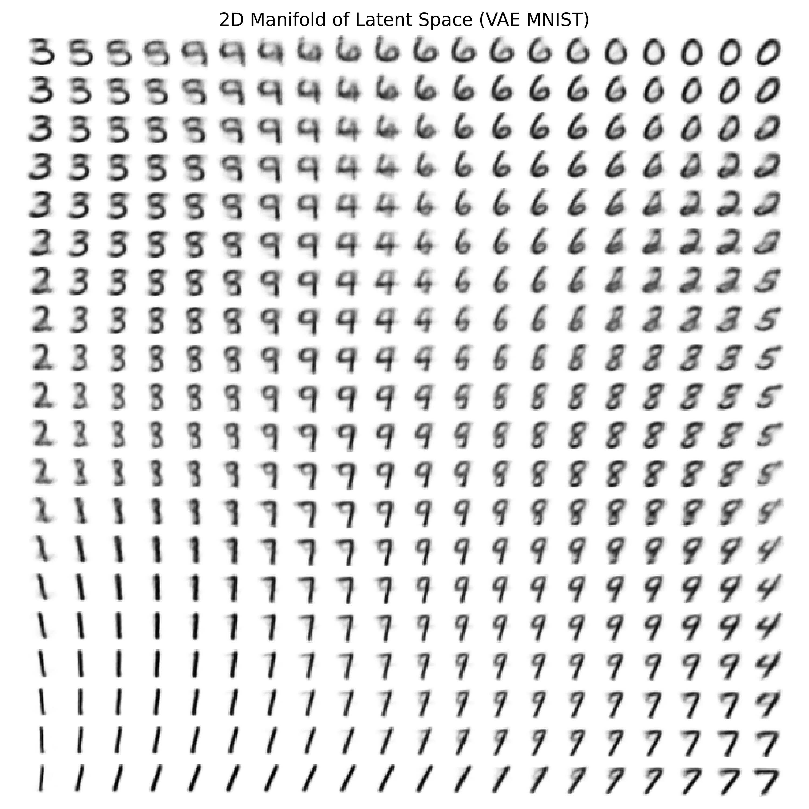
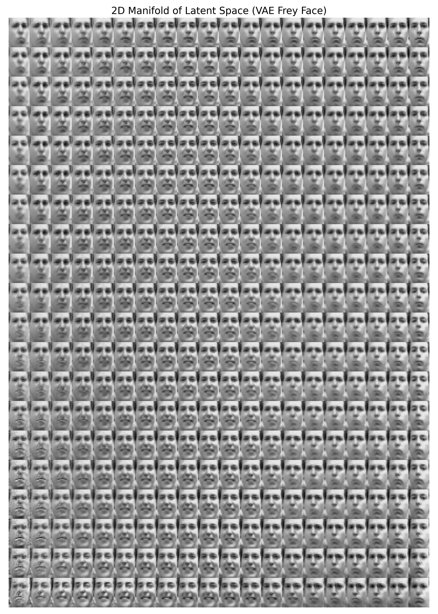
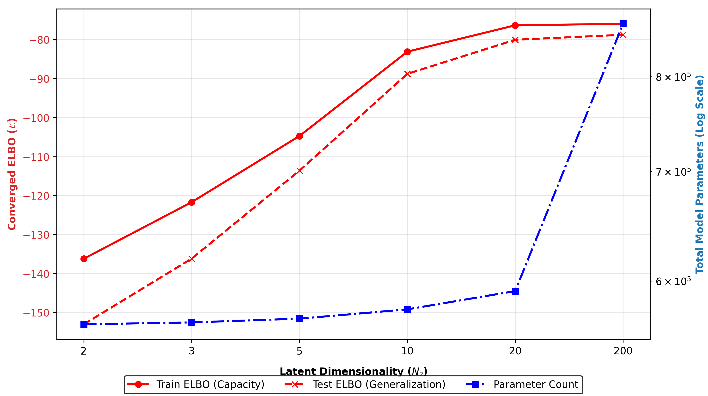

# Variational Autoencoders (VAE)

This project implements Variational Autoencoders for unsupervised learning, comparing two training approaches: the modern AEVB algorithm and the classical Wake-Sleep algorithm. Experiments are performed on two datasets with different observation models: MNIST (Bernoulli) and Frey Face (Gaussian).

## Developers

Gerardo Obeid Guzmán
Jorge Echeverría de Uribarri

## Papers Cited

- **Auto-Encoding Variational Bayes** (Kingma & Welling, 2013)
  - Primary reference for the AEVB training algorithm using the reparameterization trick
  - Details on the ELBO objective and the theoretical foundation of VAEs

- **The Wake-Sleep Algorithm for Unsupervised Neural Networks** (Hinton et al., 1995)
  - Classical alternative training approach demonstrating separate update phases
  - Provides historical context and comparison baseline

## Project Structure

```
vae/
├── models/
│   ├── vae.py               # VAE architecture (dataset-specific decoders)
│   └── loss.py              # Negative ELBO loss (Bernoulli or Gaussian)
├── utils/
│   ├── get_dataset.py       # MNIST data loading
│   ├── dataset.py           # Custom dataset for binarized MNIST
│   └── frey_face.py         # Frey Face dataset loading
├── data/                    # Datasets (auto-downloaded)
├── checkpoints/             # Saved model weights
├── results/                 # Generated visualizations and metrics
├── train_aevb_metrics.py    # AEVB training with metrics tracking
├── train_wake_sleep_metrics.py # Wake-Sleep training with metrics tracking
├── train_all_parallel.py    # Parallel training pipeline (ThreadPoolExecutor)
├── generate.py              # Generate random samples from latent space
├── generate_manifold.py     # Visualize 2D latent space manifold (MNIST)
├── generate_manifold_ff.py  # Visualize 2D latent space manifold (Frey Face)
├── plot_comparison.py       # Plot AEVB vs Wake-Sleep comparison (Figure 2)
├── model_complexity.py      # Analyze model complexity vs performance trade-off
└── requirements.txt         # Python dependencies
```

## Key Features

### VAE Architecture

#### Encoder (Shared across all datasets)

- **Architecture**: 1-layer MLP (input_dim → hidden_dim → latent_dim)
- **Hidden dim**: 500 (MNIST), 200 (Frey Face)
- **Outputs**: Mean (μ) and log-variance (log σ²) of latent Gaussian distribution

#### Decoder (Dataset-Specific)

**MNIST - Bernoulli Decoder**

- **Architecture**: 2-layer MLP (latent_dim → hidden_dim → 784)
- **Output activation**: Sigmoid (produces [0,1] probabilities)
- **Observation model**: p(x|z) = Bernoulli per pixel (binary values)
- **Loss function**: Binary cross-entropy (BCE)

**Frey Face - Gaussian Decoder**

- **Architecture**: Shared hidden layer (latent_dim → hidden_dim → Tanh), then split heads:
  - Mean head: (hidden_dim → 560, Sigmoid)
  - Variance head: (hidden_dim → 560)
- **Output activation**: Sigmoid on mean (constrain to [0,1]), unrestricted variance
- **Observation model**: p(x|z) = Gaussian per pixel (continuous values)
- **Loss function**: Gaussian negative log-likelihood

#### Latent Distribution

- **Prior**: Standard Gaussian p(z) = N(0, I)
- **Posterior**: Learned Gaussian q(z|x) = N(μ(x), diag(σ²(x)))

### Training Methods

#### AEVB (Auto-Encoding Variational Bayes)

Joint optimization of encoder and decoder using the reparameterization trick:

- **Objective**: Minimize negative ELBO: `-E_q[log p(x|z)] + KL[q(z|x) || p(z)]`
- **Reparameterization**: z = μ(x) + σ(x) ⊙ ε, where ε ~ N(0,I)
- **Optimization**: Single optimizer (Adagrad with weight decay) updates both encoder and decoder simultaneously
- **Reconstruction Loss**:
  - MNIST: Binary cross-entropy (Bernoulli decoder)
  - Frey Face: Gaussian negative log-likelihood
- **Reference**: Modern, efficient approach (Kingma & Welling, 2013)

#### Wake-Sleep Algorithm

Alternating optimization of encoder and decoder with separate phases and optimizers:

- **Wake Phase** (optimize decoder p(x|z)):
  - Sample z ~ q(z|x) from encoder (no gradients through posterior)
  - Minimize reconstruction loss:
    - MNIST: Binary cross-entropy (Bernoulli probabilities)
    - Frey Face: Gaussian NLL with Sigmoid-constrained mean
- **Sleep Phase** (optimize encoder q(z|x)):
  - Sample z ~ p(z) from prior N(0,I)
  - **Generate dreamed data** x̃ ~ p(x|z):
    - MNIST: Bernoulli sampling (convert probabilities to binary via sampling)
    - Frey Face: Gaussian sampling with reparameterization trick
  - Minimize encoder's Gaussian NLL: make q(z|x̃) assign high density to z that generated the dream
- **Optimization**: Separate Adagrad optimizers (with weight decay) for generative and recognition models
- **Reference**: Historical baseline showing separate-phase optimization (Hinton et al., 1995)

## Usage

### Quick Start: Single Model Training

#### Train AEVB on MNIST

```bash
python train_aevb_metrics.py --dataset mnist --latent_dim 20 --epochs 50
```

#### Train Wake-Sleep on Frey Face

```bash
python train_wake_sleep_metrics.py --dataset frey_face --latent_dim 20 --epochs 50
```

### Full Experimental Pipeline (Parallel Training)

To reproduce all experiments and generate Figure 2 comparison plot:

```bash
python train_all_parallel.py
```

This will:

1. Train all 18 configurations in parallel (9 workers):
   - **MNIST**: Nz ∈ {3, 5, 10, 20, 200} with AEVB & Wake-Sleep
   - **Frey Face**: Nz ∈ {2, 5, 10, 20} with AEVB & Wake-Sleep
2. Save metrics to `results/metrics/` (format: `{method}_{dataset}_{latent_dim}d_metrics.json`)
3. Automatically generate comparison plot at `results/comparison_aevb_vs_wake_sleep.png`

### Manual Configuration-by-Configuration

For individual experiments or troubleshooting:

```bash
# MNIST with increasing latent dimensions
python train_aevb_metrics.py --dataset mnist --latent_dim 3 --epochs 200 --batch_size 100 --lr 0.02
python train_wake_sleep_metrics.py --dataset mnist --latent_dim 3 --epochs 200 --batch_size 100 --lr 0.02

# Frey Face (uses more epochs for convergence)
python train_aevb_metrics.py --dataset frey_face --latent_dim 2 --epochs 6107 --batch_size 100 --lr 0.02
python train_wake_sleep_metrics.py --dataset frey_face --latent_dim 2 --epochs 6107 --batch_size 100 --lr 0.02

# Generate comparison plot after training
python plot_comparison.py
```

### Other Utilities

#### Generate random samples

```bash
python generate.py
```

#### Visualize 2D latent space manifold (MNIST)

```bash
python generate_manifold.py
```

Output: `results/manifold_vae_mnist.png` (15×15 grid of generated digits)

#### Visualize 2D latent space manifold (Frey Face)

```bash
python generate_manifold_ff.py
```

Requirements: Trained AEVB model with latent_dim=2 at `checkpoints/aevb_frey_face_2d.pth`
Output: `results/manifold_vae_freyface.png` (15×15 grid of generated faces)

#### Analyze model complexity vs performance

```bash
python model_complexity.py
```

Creates a table and dual-axis plot showing:

- Parameter count growth across latent dimensions (log scale)
- Final train/test ELBO scores for convergence comparison
- Outputs: `results/complexity_vs_overfitting.png` and printed markdown table

## Key Implementation Details

### Hyperparameters

- **Batch Size**: 100 (matches paper exactly)
- **Learning Rate**: 0.02 (Adagrad with weight decay)
- **Weight Decay**: 1e-4 (implements N(0, I) prior)
- **Latent Samples (L)**: 1 sample per datapoint; large batch provides natural gradient noise

### Decoder Configuration

| Dataset   | Architecture                | Output Activation       | Loss Function        | Sampling (Sleep)              |
| --------- | --------------------------- | ----------------------- | -------------------- | ----------------------------- |
| MNIST     | 2-layer MLP                 | Sigmoid (probabilities) | Binary cross-entropy | Bernoulli                     |
| Frey Face | Split heads (mean/variance) | Sigmoid mean            | Gaussian NLL         | Gaussian (reparameterization) |

### Optimizer Configuration

- **AEVB**: Single Adagrad optimizer for all parameters
- **Wake-Sleep**: Separate Adagrad optimizers for:
  - Generative model (decoder parameters)
  - Recognition model (encoder parameters)

## Results

### Comparison Plot (Figure 2 from Kingma & Welling)

The comparison plot shows training efficiency (negative ELBO vs samples evaluated) across latent dimensions:

**Top row**: MNIST (Bernoulli decoder)

- 5 subplots for Nz = {3, 5, 10, 20, 200}
- AEVB generally converges faster than Wake-Sleep
- Faster convergence at lower latent dimensions

**Bottom row**: Frey Face (Gaussian decoder)

- 4 subplots for Nz = {2, 5, 10, 20}
- Similar efficiency gap between methods
- Slower convergence due to continuous image pixels and variance learning

**Legend**:

- Red solid = AEVB train loss
- Red dashed = AEVB test loss
- Green solid = Wake-Sleep train loss
- Green dash-dot = Wake-Sleep test loss

**Key Observations**:

- AEVB shows smooth, stable convergence across all latent dimensions
- Wake-Sleep converges but with more variability in the sleep phase
- Frey Face (Gaussian) requires longer training than MNIST (Bernoulli) due to variance estimation
- Both methods show generalization gap (train < test in negative ELBO space)

Output: `results/comparison_aevb_vs_wake_sleep.png`

#### Comparison Plot (AEVB vs Wake-Sleep)



### Generated Samples from Latent Space

The VAE learns to generate realistic samples by sampling from the latent distribution N(0, I).

#### MNIST Generated Digits (Bernoulli Decoder)

With increasing latent dimensions, the model captures more structure:

| Nz=2                                       | Nz=5                                       | Nz=10                                        | Nz=20                                        |
| ------------------------------------------ | ------------------------------------------ | -------------------------------------------- | -------------------------------------------- |
|  |  |  |  |

### Latent Space Manifolds (2D Visualization)

Traversing the 2D latent space reveals smooth transitions between generated samples:

#### MNIST Manifold


_20×20 grid showing smooth transitions in the 2D latent space. Both AEVB-trained and Wake-Sleep-trained models with Nz=2 produce similar manifold structure._

#### Frey Face Manifold


_15×15 grid of generated faces. The Gaussian decoder captures continuous pixel intensities, allowing the model to generate diverse faces across the latent space._

### Model Complexity vs Performance

Analyzing the trade-off between model parameters and ELBO convergence:


_Dual-axis plot showing:_

- _Red lines: Train (solid) and Test (dashed) ELBO scores across latent dimensions_
- _Blue line: Total trainable parameters (log scale)_
- _Higher latent dimensions increase capacity but require more data to avoid overfitting_

## Datasets

### MNIST (Bernoulli)

- **Size**: 70,000 handwritten digits (60K train, 10K test)
- **Dimensions**: 28×28 images flattened to 784 pixels
- **Preprocessing**: Binarized at 0.5 threshold (x ∈ {0, 1})
- **Model**: Bernoulli decoder with sigmoid output
- **Loss**: Binary cross-entropy per pixel
- **Auto-downloaded** on first run from torchvision

### Frey Face (Gaussian)

- **Size**: 1,965 face images (80/20 train/test split)
- **Dimensions**: 28×20 pixels flattened to 560 dimensions
- **Preprocessing**: Normalized to [0, 1] float32 (continuous)
- **Model**: Gaussian decoder with mean and variance outputs
- **Loss**: Gaussian negative log-likelihood
- **Source**: [Kaggle Frey Face Dataset](https://www.kaggle.com/datasets/vineetvermaai/frey-face-dataset)

## Implementation Notes

### Why Different Decoders?

The choice of decoder type reflects the nature of the data:

- **MNIST (Binary)**: Each pixel is binarized to {0, 1}, so we model p(x|z) as a product of Bernoullis. Sigmoid output naturally produces probabilities [0, 1].
- **Frey Face (Continuous)**: Pixel intensities are continuous in [0, 1], so we model p(x|z) as a product of Gaussians with learnable variance. This allows the model to express uncertainty about pixel values and prevents variance collapse.

## References

Kingma, D. P., & Welling, M. (2013). Auto-encoding variational bayes. arXiv preprint arXiv:1312.6114.

Hinton, G. E., Dayan, P., Frey, B. J., & Neal, R. M. (1995). The "wake-sleep" algorithm for unsupervised neural networks. Science, 268(5214), 1158-1161.
